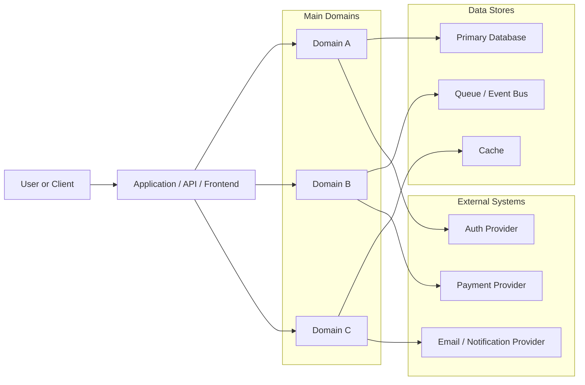
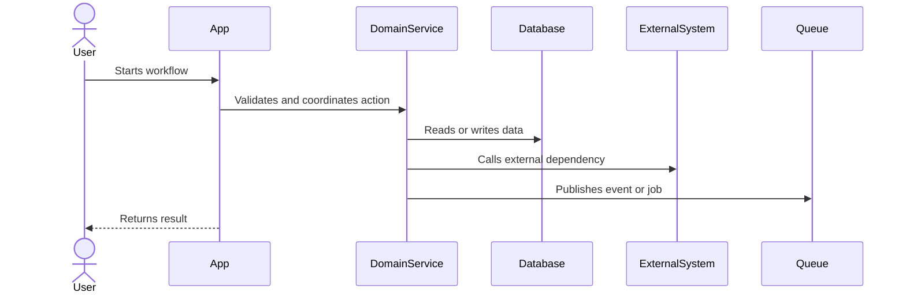

# Project Overview

This document helps humans and AI agents understand this repository quickly. Keep it practical, current, and focused on the context someone needs before making meaningful changes.

## Start Here

If you are new to this project, read these sections first:

1. Purpose.
2. How The System Fits Together.
3. Domains And Services.
4. Local Development.
5. Common Tasks.
6. Main Workflows.

Mention the most important files, commands, domains, or flows a newcomer should understand before changing code.

## Purpose

Describe what this project does, who it serves, and the main product or business outcomes it supports.

Also describe what this repository is not responsible for when that boundary matters.

## How The System Fits Together

Explain the system in plain language:

- Main application or service responsibilities.
- Primary runtime, framework, or platform.
- Main modules, domains, or layers.
- How requests, jobs, events, or user actions move through the system.
- Important boundaries between this repository and other systems.

Prefer a readable mental model over exhaustive technical detail.

## System Context Map

Use this diagram to show how users, internal domains, services, data stores, and external systems relate to each other. Keep it high-level enough that it stays useful during onboarding.

## Domains And Services

Describe the main business domains and the services, modules, or components that implement them.

Avoid listing every class, function, or low-level implementation detail. Focus on the domains and services a newcomer needs to understand before making safe changes.

### Domain Name

Purpose:
Describe the business capability this domain owns.

Responsibilities:

- Responsibility.
- Responsibility.

Main code areas:

- `path/`: why it matters.
- `path/`: why it matters.

Key services or modules:

- `ServiceName`: what it coordinates or owns.
- `ServiceName`: what it coordinates or owns.

Data owned:

- Table, collection, model, aggregate, file, or external record.
- Table, collection, model, aggregate, file, or external record.

External dependencies:

- Integration, queue, API, webhook, or service dependency.

Important workflows:

- Workflow this domain participates in.
- Workflow this domain owns.

Operational risks:

- Idempotency, consistency, retries, race conditions, auditability, sensitive-data handling, or other domain-specific risks.

## Repository Structure

- `path/`: what lives here and when someone should look here.
- `path/`: what lives here and when someone should look here.
- `path/`: what lives here and when someone should look here.

Focus on orientation. Do not list every directory unless it helps onboarding.

## Local Development

Describe how to work with the project locally:

- Required runtime versions or tools.
- Setup commands.
- Test, lint, typecheck, build, and dev commands.
- Required local services.
- Common setup problems and fixes.

Do not include secrets or production credentials.

## Common Tasks

### Add Or Change A Feature

Explain the usual path through the codebase.

### Add Or Change Tests

Explain where tests live and what patterns to follow.

### Debug A Production Issue

Explain where logs, traces, metrics, dashboards, queues, or audit records usually help.

### Change Data Or Persistence

Explain where migrations, schemas, models, repositories, or data access code live.

Add project-specific tasks that newcomers commonly need.

## Where To Look When

- Debugging authentication: start with `path/`.
- Debugging authorization: start with `path/`.
- Debugging billing or payments: start with `path/`.
- Changing background jobs: start with `path/`.
- Investigating webhook failures: start with `path/`.
- Updating UI flows: start with `path/`.

Remove items that do not apply to the project.

## Main Workflows

### Workflow Name

Describe the end-to-end flow:

1. Entry point.
2. Main services, modules, or components involved.
3. Data read or written.
4. External systems called.
5. Events, jobs, webhooks, or async processing involved.
6. Expected success outcome.
7. Common failure points.

### Critical Workflow Diagram

Use this optional sequence diagram for the most important or risky workflow in the system, such as payment, billing, onboarding, authentication, webhook processing, or async job handling.

## Data And Persistence

Describe the main data stores, important tables or collections, ownership boundaries, consistency expectations, and migration practices.

Do not include secrets, credentials, personal data, payment data, or private customer data.

## External Integrations

List important external systems:

- Integration name: purpose, direction of communication, failure impact, and where the integration code lives.

Include webhook, queue, payment, email, analytics, authentication, storage, and third-party API dependencies when relevant.

## Security And Privacy Notes

Describe authentication, authorization, sensitive data handling, input validation, logging restrictions, secret management, and rate limiting expectations.

Do not include secrets, tokens, credentials, CPF/CNPJ, emails, payment data, or private customer data.

## Reliability And Operations

Describe retries, timeouts, idempotency, duplicate-processing protections, dead-letter behavior, rollback considerations, and observability.

## Testing And Validation

Describe expected validation:

- Unit tests.
- Integration tests.
- Contract tests.
- End-to-end tests.
- Manual validation.
- Common commands.

## Glossary

- Business term: short explanation.
- Domain term: short explanation.
- System acronym: short explanation.

## Agent Operating Notes

Agents should read this file before meaningful implementation work.

When this file is missing, agents should inspect the project and suggest creating it before or alongside meaningful implementation work.

Before changing behavior, agents should understand the existing project structure, patterns, architecture, naming conventions, folder organization, frameworks, libraries, and test style.

After implementation, agents should run applicable tests or validation checks and summarize security, reliability, and compatibility considerations. For frontend changes, include browser-based validation when user flows, routing, forms, visual layout, responsiveness, authentication, checkout, onboarding, or other UI behavior is affected. If the project uses Playwright, Cypress, or another end-to-end framework, run related tests for affected flows when practical.

## Documentation Governance

Update this overview when changes affect:

- Project purpose.
- Architecture or module boundaries.
- Main domains or services.
- Main workflows.
- Repository structure.
- External integrations.
- Data ownership or persistence.
- Security or permission model.
- Reliability or operational behavior.
- Testing strategy.
- Important trade-offs.

For meaningful development decisions, create or update a decision log entry when the repository uses decision logs.

## Current Design Decisions

- Decision or trade-off currently shaping the project.
- Decision or trade-off currently shaping the project.
